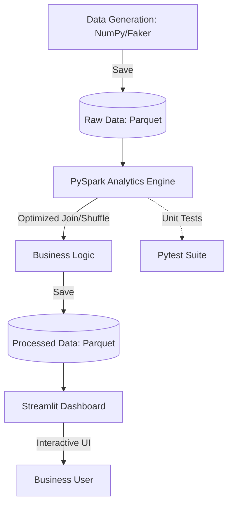

# 🛒 E-Commerce GenAI Analytics Pipeline

An end-to-end high-performance data pipeline simulating a real-world e-commerce environment. This project generates 1.11M synthetic records and processes them using an optimized PySpark configuration on local hardware, visualized through an interactive Streamlit dashboard.

## 💡 Project Overview
This project demonstrates a complete data analytics workflow, from synthetic data generation and optimized PySpark processing to interactive visualization. It's designed for local development on resource-constrained systems (like an 8GB RAM laptop) while showcasing production-ready practices.
## 🏗️ Architecture Diagram



## 🚀 Features
- **Scalable Data Gen**: 1.11M+ records with Pareto (80/20) distribution logic.
- **Optimized Spark**: Kryo serialization, Adaptive Query Execution (AQE), and custom memory management tuned for 8GB RAM systems.
- **High Throughput**: Processes ~1.1M rows with complex joins in under 3 seconds.
- **Interactive BI**: Real-time insights and growth metrics via Streamlit and Plotly.

## 🛠️ Setup Instructions

### 1. Prerequisites
- **Python**: 3.10 - 3.12 (Recommended for PySpark stability).
- **Java**: JRE 8 or 11 installed and added to `PATH`.

### 2. Installation
```bash
git clone <repository-url>
cd genai-pyspark-pipeline
python -m venv venv
source venv/bin/activate  # Windows: venv\Scripts\activate
pip install -r requirements.txt
```

### 3. Windows Specific Setup (Hadoop/Winutils)
To enable Spark write operations on Windows, you must provide `winutils.exe`:
1. Create a folder `C:\hadoop\bin`.
2. Download `winutils.exe` and `hadoop.dll` for Hadoop 3.3.0 from a reputable source like cdmsrc/winutils and place them in that folder.
3. Set a system environment variable `HADOOP_HOME` to `C:\hadoop`.
4. Ensure JAVA_HOME points to your JDK installation.
   (e.g., `JAVA_HOME=C:\Program Files\Java\jdk-11.0.12`)

## 📈 Usage Examples

### Step 1: Generate Synthetic Data
Populates `data/raw/` with 100K customers, 10K products, and 1M orders in optimized Parquet format.
```bash
python main.py
```

### Step 2: Run Spark Analytics Pipeline
Executes top customer analysis, category sales distribution, and monthly revenue trends.
```bash
python run_analytics.py
```

### Step 3: Launch Interactive Dashboard
Open the visual interface to explore the processed insights and trigger pipeline runs.
```bash
streamlit run dashboard.py
```

### Step 4: Run Unit Tests
Verify the analytics logic using the mock-data test suite.
```bash
python -m pytest tests/test_spark_analytics.py
```
### Step 5: Start the Daily Scheduler
Runs the entire pipeline (generation + analytics) every day at midnight.
```bash
python scheduler.py
```

## 📂 Project Structure
- `src/`: Core package containing configuration, data generator, and Spark engine.
- `data/raw/`:  Storage for the 1.11M record synthetic dataset (Parquet).
- `data/processed/`: Aggregated insights saved by the Spark engine (Parquet).
- `tests/`: Pytest suite for business logic and Spark transformations.
-  `main.py`: Entry point for synthetic data generation.
- `run_analytics.py`: Production-ready analytics execution script.
- `dashboard.py`: Streamlit BI dashboard.
- `scheduler.py`: Automation script for daily batch processing.
- `verify_project.py`: Project audit and synchronization tool. 
- `packages.txt`: System dependencies for Streamlit Cloud deployment.
- `requirements.txt`: Python package dependencies.
- `SPARK_CONFIG_GUIDE.md`: Detailed guide on Spark optimizations.
- `LICENSE`: Project license.

## ⚙️ Spark Optimizations
| Parameter | Value | Impact |
|-----------|-------|--------|
| Serializer | Kryo | 2-10x faster serialization |
| Shuffle Partitions | 16 | Reduced overhead for 2-core systems |
| AQE | Enabled | Handles data skew automatically |
| Driver Memory | 4GB | Optimized for local result collection |
| Executor Memory | 2GB | Per-executor computation |

## ❓ Troubleshooting

**Py4JJavaError / Winutils Error:**
If you see an error mentioning `winutils.exe` while saving Parquet files on Windows:
1. Verify `C:\hadoop\bin\winutils.exe` exists.
2. Verify the `HADOOP_HOME` environment variable is set to `C:\hadoop` and `%HADOOP_HOME%\bin` is in your `PATH`.

**Java Gateway Process Exited:**
This usually occurs if Java is not in your `PATH` or if you are using an incompatible Python version (3.14+). Revert to Python 3.10-3.12 for maximum stability with PySpark 3.5.
1. Run `echo %JAVA_HOME%` to verify the variable is set.
2. Run `java -version` to ensure the JDK is accessible.

---
*Generated by Gemini Code Assist - Senior Engineering Review*